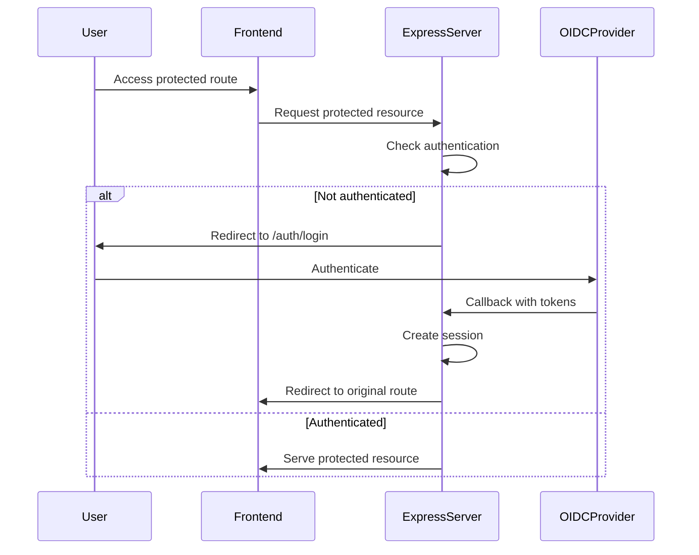

# Authentication Guide

This document provides comprehensive information about the authentication system implemented in this Express.js + React application.

## Table of Contents

- [Architecture Overview](#architecture-overview)
- [Configuration](#configuration)
- [Provider Examples](#provider-examples)
  - [Azure Entra ID (Azure AD)](#azure-entra-id-azure-ad)
  - [AWS Cognito](#aws-cognito)
  - [Auth0](#auth0)
- [Development Mode](#development-mode)
- [API Endpoints](#api-endpoints)
- [Frontend Integration](#frontend-integration)
- [Troubleshooting](#troubleshooting)

## Architecture Overview

The authentication system is built using:

- **Express.js** with session-based authentication
- **Passport.js** with OpenID Connect strategy
- **express-session** for session management
- **passport-openidconnect** for OIDC integration

### Authentication Flow



### File Structure

```
server/src/api/middleware/
└── auth.ts                 # Main authentication middleware
    ├── isAuthDisabled()     # Check if auth is disabled
    ├── configureSession()   # Session configuration
    ├── configurePassport()  # Passport OIDC setup
    ├── requireAuth()        # Authentication middleware
    ├── createAuthRoutes()   # Auth route handlers
    └── initializeAuth()     # Main initialization function
```

## Configuration

### Environment Variables

Create a `.env` file in your server directory with the following variables:

```bash
# Server Configuration
PORT=8324
FRONTEND_DIST=../frontend/dist
NODE_ENV=development

# Session Configuration (Required)
SESSION_SECRET=your-random-256-bit-secret-key-here

# Authentication Toggle
DISABLE_AUTH=false  # Set to 'true' for development without OIDC setup

# OpenID Connect Provider Configuration (Provider-specific)
OIDC_ISSUER=https://your-provider-issuer-url
OIDC_AUTHORIZATION_URL=https://your-provider-auth-url
OIDC_TOKEN_URL=https://your-provider-token-url
OIDC_USERINFO_URL=https://your-provider-userinfo-url
OIDC_CLIENT_ID=your-client-id
OIDC_CLIENT_SECRET=your-client-secret
OIDC_CALLBACK_URL=http://localhost:8324/auth/callback
```

### Required Dependencies

Add these to your `package.json`:

```json
{
  "dependencies": {
    "express-session": "^1.17.3",
    "passport": "^0.6.0",
    "passport-openidconnect": "^0.1.1"
  },
  "devDependencies": {
    "@types/express-session": "^1.17.7",
    "@types/passport": "^1.0.12"
  }
}
```

## Provider Examples

### Azure Entra ID (Azure AD)

#### 1. Azure Portal Setup

1. **Register Application:**
   - Go to Azure Portal → Azure Active Directory → App registrations
   - Click "New registration"
   - Name: Your application name
   - Supported account types: Choose appropriate option
   - Redirect URI: `http://localhost:8324/auth/callback` (development)

2. **Configure Authentication:**
   - Go to Authentication section
   - Add redirect URIs for all environments
   - Enable "ID tokens" under Implicit grant and hybrid flows

3. **Create Client Secret:**
   - Go to Certificates & secrets
   - Click "New client secret"
   - Copy the secret value immediately

4. **API Permissions (Optional):**
   - Go to API permissions
   - Add Microsoft Graph permissions: `User.Read`, `profile`, `email`

#### 2. Environment Configuration

```bash
# Azure Entra ID Configuration
OIDC_ISSUER=https://login.microsoftonline.com/{your-tenant-id}/v2.0
OIDC_AUTHORIZATION_URL=https://login.microsoftonline.com/{your-tenant-id}/oauth2/v2.0/authorize
OIDC_TOKEN_URL=https://login.microsoftonline.com/{your-tenant-id}/oauth2/v2.0/token
OIDC_USERINFO_URL=https://graph.microsoft.com/oidc/userinfo
OIDC_CLIENT_ID=your-application-client-id
OIDC_CLIENT_SECRET=your-application-client-secret
OIDC_CALLBACK_URL=http://localhost:8324/auth/callback
```

#### 3. Find Your Azure IDs

- **Tenant ID:** Azure AD → Overview → Tenant ID
- **Client ID:** App registrations → Your app → Overview → Application (client) ID

### AWS Cognito

#### 1. AWS Cognito Setup

1. **Create User Pool:**
   - Go to AWS Cognito console
   - Create new User Pool
   - Configure sign-in options (email, username, etc.)
   - Set password policy and MFA settings

2. **Create User Pool Client:**
   - In your User Pool → App clients
   - Create new app client
   - Enable "Generate client secret"
   - Configure OAuth flows: Authorization code grant
   - Set callback URLs: `http://localhost:8324/auth/callback`

3. **Configure Hosted UI (Optional):**
   - Go to App integration → Domain
   - Create custom domain or use Cognito domain
   - Configure OAuth scopes: `openid`, `profile`, `email`

#### 2. Environment Configuration

```bash
# AWS Cognito Configuration
OIDC_ISSUER=https://cognito-idp.{region}.amazonaws.com/{user-pool-id}
OIDC_AUTHORIZATION_URL=https://{domain}.auth.{region}.amazoncognito.com/oauth2/authorize
OIDC_TOKEN_URL=https://{domain}.auth.{region}.amazoncognito.com/oauth2/token
OIDC_USERINFO_URL=https://{domain}.auth.{region}.amazoncognito.com/oauth2/userInfo
OIDC_CLIENT_ID=your-cognito-client-id
OIDC_CLIENT_SECRET=your-cognito-client-secret
OIDC_CALLBACK_URL=http://localhost:8324/auth/callback
```

#### 3. Find Your Cognito Values

- **User Pool ID:** Cognito → User pools → Your pool → General settings
- **Client ID:** User pool → App clients → Your client
- **Domain:** User pool → App integration → Domain
- **Region:** Your AWS region (e.g., `us-east-1`)

### Auth0

#### 1. Auth0 Dashboard Setup

1. **Create Application:**
   - Go to Auth0 Dashboard → Applications
   - Click "Create Application"
   - Choose "Regular Web Applications"
   - Select technology: Node.js

2. **Configure Settings:**
   - Allowed Callback URLs: `http://localhost:8324/auth/callback`
   - Allowed Logout URLs: `http://localhost:8324`
   - Allowed Web Origins: `http://localhost:8324`

3. **Get Application Details:**
   - Note down Domain, Client ID, and Client Secret
   - These are found in the application settings

#### 2. Environment Configuration

```bash
# Auth0 Configuration
OIDC_ISSUER=https://{your-domain}.auth0.com/
OIDC_AUTHORIZATION_URL=https://{your-domain}.auth0.com/authorize
OIDC_TOKEN_URL=https://{your-domain}.auth0.com/oauth/token
OIDC_USERINFO_URL=https://{your-domain}.auth0.com/userinfo
OIDC_CLIENT_ID=your-auth0-client-id
OIDC_CLIENT_SECRET=your-auth0-client-secret
OIDC_CALLBACK_URL=http://localhost:8324/auth/callback
```

#### 3. Find Your Auth0 Values

- **Domain:** Auth0 Dashboard → Applications → Your app → Domain
- **Client ID:** Applications → Your app → Client ID
- **Client Secret:** Applications → Your app → Client Secret

## Development Mode

For development without setting up an OIDC provider:

```bash
# Disable authentication
DISABLE_AUTH=true
```

### Development Features

- **No OIDC required:** Application works without external authentication
- **Mock user data:** `/auth/user` returns fake user information
- **Console warnings:** Clear indicators that auth is disabled
- **API compatibility:** All auth endpoints return appropriate responses

### Mock User Response

```json
{
  "user": {
    "id": "dev-user",
    "name": "Development User",
    "email": "dev@example.com"
  },
  "authenticated": true,
  "message": "Authentication disabled - mock user data"
}
```

## API Endpoints

### Authentication Endpoints

| Endpoint | Method | Description | Response |
|----------|--------|-------------|----------|
| `/auth/login` | GET | Initiate OIDC login | Redirect to provider |
| `/auth/callback` | GET | OIDC callback handler | Redirect to home |
| `/auth/logout` | GET | Logout user | Redirect to home |
| `/auth/user` | GET | Get user info | JSON user data |

### Protected Routes

All routes are protected by the `requireAuth` middleware:

- **API routes:** `/api/*` - Returns 401 if not authenticated
- **Static files:** All frontend assets require authentication
- **SPA routes:** All frontend routes require authentication

### Response Examples

#### Authenticated User Info
```json
{
  "user": {
    "id": "user-id",
    "displayName": "John Doe",
    "emails": [{"value": "john@example.com"}],
    "provider": "oidc"
  },
  "authenticated": true
}
```

#### Unauthenticated API Request
```json
{
  "error": "Authentication required"
}
```

## Frontend Integration

### Check Authentication Status

```javascript
// Check if user is authenticated
fetch('/auth/user')
  .then(response => response.json())
  .then(data => {
    if (data.authenticated) {
      console.log('User:', data.user);
    }
  })
  .catch(error => {
    console.log('Not authenticated');
  });
```

### Login/Logout Links

```html
<!-- Login -->
<a href="/auth/login">Login</a>

<!-- Logout -->
<a href="/auth/logout">Logout</a>
```

### Handling Authentication in React

```jsx
import React, { useState, useEffect } from 'react';

function useAuth() {
  const [user, setUser] = useState(null);
  const [loading, setLoading] = useState(true);

  useEffect(() => {
    fetch('/auth/user')
      .then(response => response.json())
      .then(data => {
        if (data.authenticated) {
          setUser(data.user);
        }
        setLoading(false);
      })
      .catch(() => {
        setLoading(false);
      });
  }, []);

  return { user, loading };
}

function App() {
  const { user, loading } = useAuth();

  if (loading) return <div>Loading...</div>;

  if (!user) {
    return <a href="/auth/login">Please Login</a>;
  }

  return (
    <div>
      <p>Welcome, {user.displayName}!</p>
      <a href="/auth/logout">Logout</a>
    </div>
  );
}
```

## Troubleshooting

### Common Issues

#### 1. "Cannot read property 'isAuthenticated' of undefined"

**Problem:** Passport not properly initialized.

**Solution:** Ensure `initializeAuth(app)` is called after session configuration.

#### 2. "Invalid redirect_uri"

**Problem:** Callback URL mismatch between application and provider.

**Solution:** Verify `OIDC_CALLBACK_URL` matches the redirect URI configured in your OIDC provider.

#### 3. "Client authentication failed"

**Problem:** Incorrect client credentials.

**Solution:** 
- Verify `OIDC_CLIENT_ID` and `OIDC_CLIENT_SECRET`
- Ensure client secret hasn't expired (common in Azure AD)

#### 4. Session not persisting

**Problem:** Session configuration issues.

**Solution:**
```javascript
// Check session configuration
{
  secret: process.env.SESSION_SECRET, // Must be set and consistent
  resave: false,
  saveUninitialized: false,
  cookie: { 
    secure: process.env.NODE_ENV === 'production', // false for development
    maxAge: 24 * 60 * 60 * 1000 // 24 hours
  }
}
```

#### 5. CORS Issues

**Problem:** Cross-origin requests blocked during authentication.

**Solution:** Ensure CORS middleware allows your frontend domain:

```javascript
// In cors.ts
const corsOptions = {
  origin: ['http://localhost:3000', 'http://localhost:8324'],
  credentials: true // Important for sessions
};
```

### Debug Mode

Enable debug logging by setting:

```bash
DEBUG=passport*,express-session
```

### Health Check

Create a simple test endpoint to verify authentication setup:

```javascript
app.get('/auth/health', (req, res) => {
  res.json({
    sessionConfigured: !!req.session,
    passportConfigured: !!req.passport,
    authenticated: req.isAuthenticated ? req.isAuthenticated() : false,
    environment: process.env.NODE_ENV,
    authDisabled: process.env.DISABLE_AUTH === 'true'
  });
});
```

### Production Considerations

1. **Use HTTPS:** Set `cookie.secure: true` in production
2. **Strong session secret:** Use a cryptographically secure random string
3. **Session store:** Use Redis or database-backed session store for production
4. **Environment variables:** Never commit secrets to version control
5. **CSP headers:** Configure Content Security Policy for enhanced security
6. **Rate limiting:** Implement rate limiting on auth endpoints

### Security Best Practices

- Use strong, random session secrets (256-bit minimum)
- Enable HTTPS in production
- Set appropriate cookie settings
- Implement CSRF protection
- Use secure session stores (Redis, MongoDB) in production
- Regular security audits of dependencies
- Monitor authentication failures
- Implement proper logging without exposing sensitive data

## Support

For additional support:

1. Check provider documentation (Azure AD, Cognito, Auth0)
2. Review Passport.js documentation
3. Enable debug logging for detailed error messages
4. Test authentication flow step by step
5. Verify environment variables are correctly set

---

**Note:** This authentication system provides enterprise-grade security when properly configured. Always test thoroughly before deploying to production.
